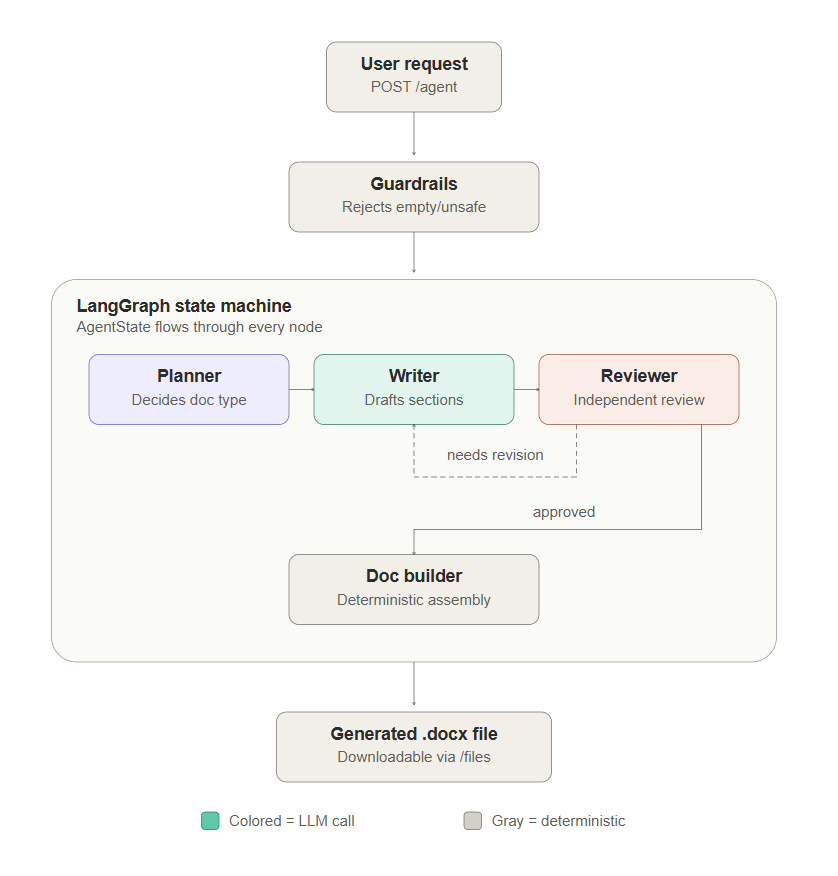

# Autonomous Document Agent

A FastAPI service with a web UI that accepts a natural-language business request, autonomously plans its own structure via a LangGraph state machine (Planner → Writer → Reviewer → Doc Builder, with a conditional revision loop), and returns a polished `.docx` file — with full transparency into each step of the pipeline.



### Technologies Used

| Category | Tools |
|---|---|
| **Framework** | FastAPI, Uvicorn |
| **Graph State Machine** | LangGraph |
| **LLM Provider** | Groq (free tier) |
| **Models** | `llama-3.3-70b-versatile`, `openai/gpt-oss-120b` (fallback) |
| **Structured Output** | Pydantic, `with_structured_output` |
| **Document Assembly** | `python-docx` |
| **Validation** | Pydantic, custom guardrails |
| **UI** | HTML + CSS + Vanilla JS (no framework dependencies) |

## 1. Setup

```bash
# If using the bundled virtual environment:
venv\python.exe -m pip install -r requirements.txt

# Or create your own:
python -m venv .venv
.venv\Scripts\activate      # Windows
# source .venv/bin/activate  # macOS / Linux

pip install -r requirements.txt

cp .env.example .env
# edit .env and paste a free Groq API key from https://console.groq.com/keys
```

## 2. Run

```bash
# Using the bundled venv:
venv\python.exe -m uvicorn main:app --reload

# Or with your own:
uvicorn main:app --reload
```

Open **`http://127.0.0.1:8000`** in your browser for the pipeline visualization UI.

The REST API is also available at the same base URL. Interactive docs (Swagger UI) at `http://127.0.0.1:8000/docs`.

## 3. Using the Pipeline UI

The web interface at `http://127.0.0.1:8000` provides a step-by-step visualization of the document generation process:

1. **Enter a business request** in the textarea and click "Generate Document"
2. **Watch the pipeline progress** — an animated loading skeleton shows each node as it runs
3. **Review the results** — each node appears as an expandable card showing its specific output:
   - **Planner** — document type, title, and the full list of planned sections with their purposes
   - **Writer** — the drafted content for every section, displayed in full
   - **Reviewer** — verdict (approved / needs revision), any gaps found, and assumptions made
   - **Doc Builder** — download link for the generated `.docx`
4. **Download the document** — click the button to save the polished `.docx` file

## 4. API Reference

### `POST /agent`

Accepts a natural-language request and returns the pipeline result.

**Request body:**
```json
{
  "request": "Create a project proposal for migrating our internal tools from spreadsheets to a new CRM system..."
}
```

**Response:**
```json
{
  "plan": [
    "Classified request as: project_proposal. Planned sections: Executive Summary, ...",
    "Drafted all planned sections.",
    "Reviewed draft — verdict: approved.",
    "Document generated."
  ],
  "doc_type": "project_proposal",
  "outline": {
    "doc_type": "project_proposal",
    "title": "CRM Migration Project Proposal",
    "sections": [
      { "section_name": "Executive Summary", "purpose": "...", "needs_table": false },
      { "section_name": "Budget", "purpose": "...", "needs_table": true }
    ]
  },
  "sections": {
    "Executive Summary": { "section_name": "Executive Summary", "content": "...", "needs_table": false },
    "Budget": { "section_name": "Budget", "content": "...", "needs_table": true }
  },
  "review": {
    "verdict": "approved",
    "gaps": [],
    "assumptions_made": []
  },
  "assumptions_made": [],
  "revision_occurred": false,
  "download_url": "/files/project_proposal_20260711_143210.docx",
  "message": "Generated a project proposal covering 5 section(s)."
}
```

### `GET /files/{filename}`

Download a generated `.docx` file.

### `GET /health`

Returns `{"status": "ok"}`.

## 5. Test Case 1 — Standard Request

```bash
curl -X POST http://127.0.0.1:8000/agent \
  -H "Content-Type: application/json" \
  -d '{
    "request": "Create a project proposal for migrating our internal tools from spreadsheets to a new CRM system (evaluating HubSpot vs Salesforce). Timeline is 3 months starting next quarter, budget is $50k, and the primary goal is reducing manual data entry for the sales team of 12 people. Include a rollout plan and key risks."
  }'
```

Expected: `doc_type` is `"project_proposal"`, `assumptions_made` is empty, `revision_occurred` is `false` — everything needed was stated up front.

## 6. Test Case 2 — Ambiguous Request

```bash
curl -X POST http://127.0.0.1:8000/agent \
  -H "Content-Type: application/json" \
  -d '{
    "request": "Need something to send the client after today'\''s call. Sales said we could do the integration in 3 weeks, but engineering mentioned on Slack it'\''s more like 6-8 weeks realistically — not sure which number to use. Client hasn'\''t confirmed budget yet either. Not sure if they want a formal proposal or just a quick summary of next steps, and my manager wants it before end of day."
  }'
```

Expected: the Planner infers a document type despite no explicit instruction, the Reviewer flags missing budget/timeline as gaps, and the final `.docx` includes an **Assumptions Made** section disclosing what was inferred rather than silently fabricating specifics.

## 7. Project Structure

```
├── main.py                    # FastAPI app: POST /agent, GET /, GET /files/{filename}
├── schemas.py                 # Pydantic: API contracts, structured LLM outputs, AgentState
├── graph.py                   # LangGraph StateGraph wiring + conditional revision edge
├── guardrails.py              # Pre-graph request validation (length, unsafe keywords)
├── llm_client.py              # Groq client with primary/fallback model retry
├── doc_builder.py             # Deterministic python-docx assembly (not an LLM node)
├── nodes/
│   ├── __init__.py
│   ├── planner.py             # Infers doc type and produces structured outline
│   ├── writer.py              # Drafts each section (context-flat, revision-aware)
│   ├── reviewer.py            # Independent quality check + revision loop guard
│   └── doc_builder_node.py    # Thin graph adapter for doc_builder.py
├── templates/
│   └── index.html             # Pipeline visualization UI
├── asset/
│   └── autonomous_doc_agent.png
├── outputs/                   # Generated .docx files land here
│   └── .gitkeep
├── .gitignore
├── .env.example
└── requirements.txt
```

## 8. Pipeline Architecture

```
START ──→ Planner ──→ Writer ──→ Reviewer ──→ Doc Builder ──→ END
                                    │
                       (needs_revision & under cap)
                                    │
                                    └──→ Writer (revision pass)
```

| Node | Responsibility | Output |
|---|---|---|
| **Planner** | Infers document type and plans a structured outline of sections | `OutlineSchema` (doc_type, title, sections) |
| **Writer** | Drafts content for each section, one LLM call per section | `dict[SectionSchema]` (section_name, content) |
| **Reviewer** | Independent quality check against the original request | `ReviewSchema` (verdict, gaps, assumptions) |
| **Doc Builder** | Assembles the final `.docx` (no LLM, pure `python-docx`) | Saved `.docx` file path |

## 9. Improvement: Reflection / Self-Check with Revision Loop

Implemented as the Reviewer node + a LangGraph conditional edge back to the Writer, capped at one revision pass. The Reviewer runs with a **deliberately scoped context** — it sees only the original request and the final draft, never the Planner's or Writer's intermediate reasoning — which mimics an independent critic rather than the same model grading its own work.

Paired with lightweight **retry & fallback** in `llm_client.py`: every LLM call tries `llama-3.3-70b-versatile` first and falls back to `openai/gpt-oss-120b` (same provider, same free tier) on rate-limiting or failure.

## 10. Notes on Free-Tier Limits

Groq's free tier (`llama-3.3-70b-versatile`): 30 RPM / 1,000 RPD / 12K TPM / 100K TPD. A full document run uses roughly 6–8 LLM calls (one per section plus Planner and Reviewer). Verify current limits at `console.groq.com/settings/limits` before recording a demo, since free-tier numbers shift over time.
